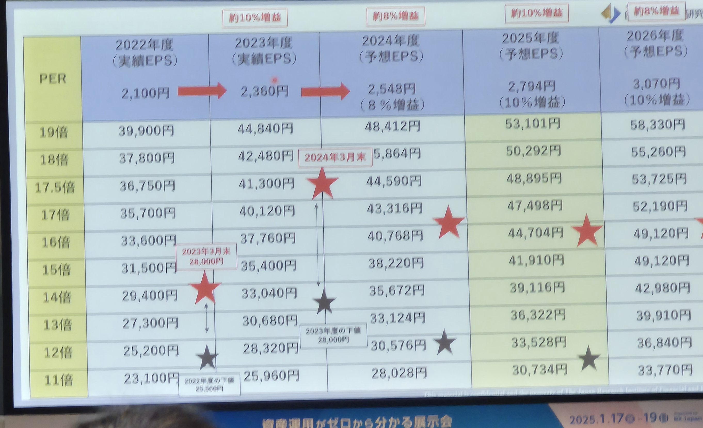

# portfolio 2025

## 学習目標

`今年も学習を継続するぞ。目標を追記せよ`

- 読書目標(予算: 20万円)
  - セキュアで信頼性のあるシステム構築
    - 第II部　システムの設計
      - 3章　ケーススタディ：セーフプロキシ
      - 4章　設計におけるトレードオフ
      - 5章　最小権限を前提とする設計
      - 6章　理解しやすさに配慮した設計
      - 7章　状況の変化に対応する設計
      - 8章　弾力性を担保する設計(次はここ)
      - 9章　リカバリを想定した設計
  - SLOサービスレベル目標(5章エラーバジェットの使い方、6章同意の獲得、7章 SLIとSLOの計測を読解した。9章SLIとSLOの確率と統計を読解中)
  - 入門 OpenTelemetry(9章読解中
  - パスキーのすべて
  - Real World HTTP
  - TBD...
- 実践目標
  - AI x AWS SRE x Web Backend
    - epbf x aws 
- 経済目標
  - トレンドの理解のための情報収集, 市場への参加を継続する
  - リターン目標を達成する
  - 金融リテラシー向上のアクションをとる(3つ)
    - 1月の資産運用EXPOに参加する
      - 貿易収支の黒字転換する可能性
      - 25年も賃上げに成功すればデフレ脱却を確実に
      - 税収は過去最高。金があるとこにはある
      - 企業業績10%成長見通し？
      - 成長企業にのれるか？
      - 日銀政策金利の利上げ。やっぱりやる？2025年末1.0%まであがる？(植田総裁の中立金利は不明。いずれ3%?)
      - 米国利下げ２回の見通しだっけけど、なくなるかも？最悪再利上げ
      - トランプ大統領関税ディール
        - 21%の法人税率を一部15%に
        - 石油ガスの採掘推進？
        - 不法移民強制送還
        - M&A,暗号資産の規制緩和、ドル安誘導
      - 日本、米国の増益見通し。株価要因
      - S&P500の成長率15%?2022年はマイナス20%,前のトランプ就任年もマイナスなので警戒体制
      - 金融、通信、消費財セクター注目
      - pc電子機器小売駆け込み
      - NISA インド,FANG
      - ROI,コーポレート・ガバナンス改革の継続性、東証の市場改革が日本株への継続投資の鍵。海外投資家の注目のまと。
      - 在庫関連、倉庫
      - 円安の追い上げ
      - 日経平均シナリオ
      - 
    - テクニカル分析（一般的チャート分析の解像度を１つ上げる）
