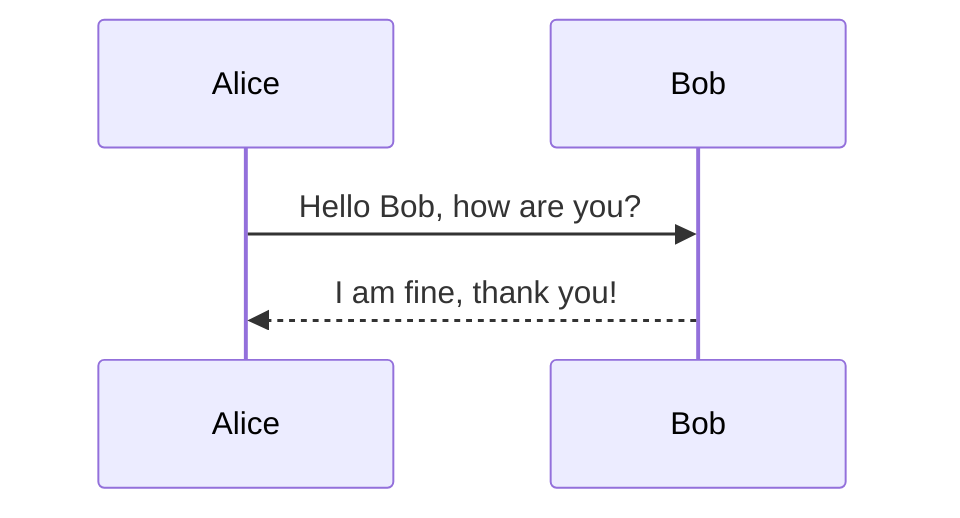
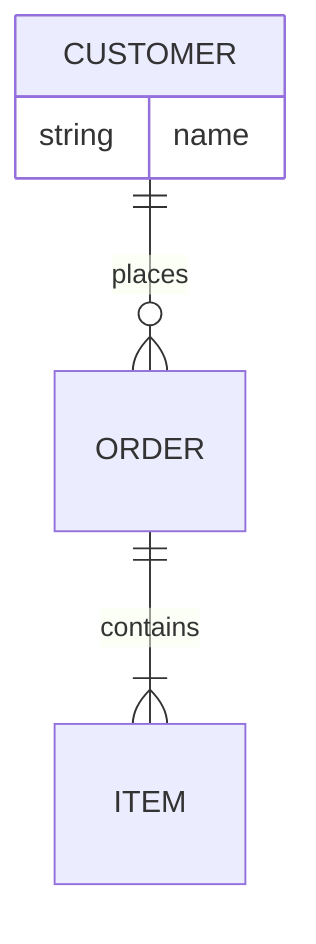
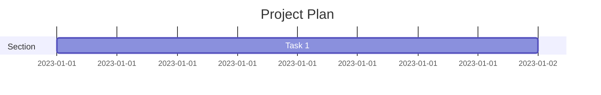
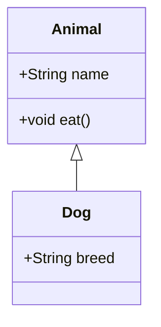
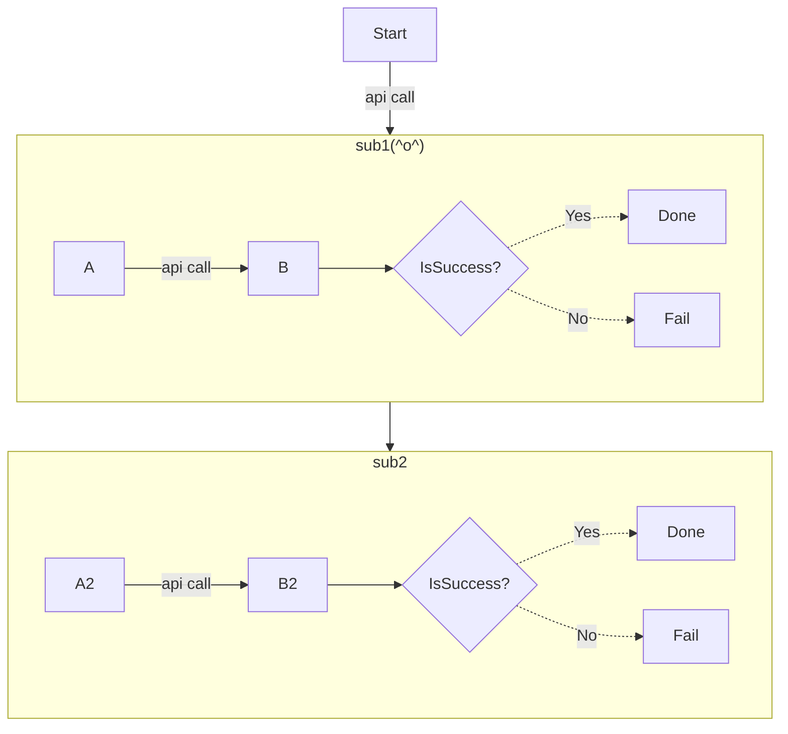
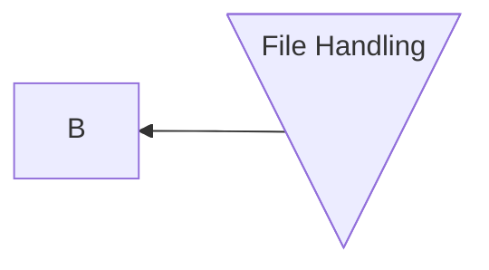

```mermaid
architecture-beta
    group api(logos:aws-lambda)[API]

    service db(logos:aws-aurora)[Database] in api
    service disk1(logos:aws-glacier)[Storage] in api
    service disk2(logos:aws-s3)[Storage] in api
    service server(logos:aws-ec2)[Server] in api

    db:L -- R:server
    disk1:T -- B:server
    disk2:T -- B:db
```

# Mermaidスニペット
## Reference

- Flowchart Diagram https://mermaid.js.org/syntax/flowchart.html
- Sequence Diagram https://mermaid.js.org/syntax/sequenceDiagram.html
- Class Diagram https://mermaid.js.org/syntax/classDiagram.html
- Entity Relationship Diagram https://mermaid.js.org/syntax/entityRelationshipDiagram.html
- Architecture 🔥 https://mermaid.js.org/syntax/architecture.html

## Sample

### 20. Architecture
- **Example:**

- **Components:**
  - Systems: Logical units.

### 1. Sequence Diagram

- **Example:**



- **Components:**
  - `participant`: Define entities (e.g., Alice, Bob).
  - `->>`: Denotes messages.
  - `-->>`: Denotes responses.

### 4. Entity Relationship Diagram

- **Example:**


- **Components:**
  - Entities: `CUSTOMER`, `ORDER`, `ITEM`.
  - Relationships: `||--o{` (one-to-many).

### 6. Gantt

- **Example:**



- **Components:**
  - `section`: Logical grouping.
  - Tasks: Defined with duration.

### 2. Class Diagram

- **Example:**

- **Components:**
  - `class`: Defines a class.
  - Attributes and methods: Listed inside the class.
  - Relationships: `<|--` denotes inheritance.


### 0. Flowchart

- flowchartの例



- Expanded Node Shapes in Mermaid Flowcharts (v11.3.0+)
  - Mermaid introduces 30 new shapes to enhance the flexibility and precision of flowchart creation. 



- flowchartの構成要素
  - flowchart: mermaid flowchartのエントリーポイント
  - orientation: フローチャートの向き。LRは左から右に向かうチャート,TBは上から下に向かうチャート。
  - span(arrow) style: 動線のスタイル。実線と点線。右端・両端の矢印・記号(<, >・x・⚫︎)の有無が調整可能。、---は動線のみ・記号なし, -.-は動線のみ・記号なしで点線, -->は右向きの矢印・実線, --oは右側に⚫︎がついた実線, --xは右側にxがついた実線, <-->は両端に矢印がついた動線, o--oは両端に⚫︎がついた動線, x--xは両端にxがついた動線
  - span length: 矢印の長さは、ハイフン(-)の数で調整可能。数が多い方が長い。-->, ---->, ----->, -.->, -...->, -....->
  - text label: ノードや動線にラベルを付与できる。例えばY2[Done]は、Y2というノードのラベルをDoneと設定する。--> |api call|は、動線（右矢印付きの実線）に「api call」というラベルを設定する
  - conditional process(): ノード作成時に{}という括弧記号を使うことで、条件分岐のノードを作成できる。条件分岐ノードの具体例はCheckResultB2{IsSuccess?}。CheckResultB2という分岐のノード（菱形の図形）をフローチャート上に作成される（表示されるラベルはIsSuccess?）
  - subgraph: 「subgraph」という構文で、フローチャート内に複数の部分チャートを表現することができる subgraph 名前 で始まり endで終わる。
  - click: ノードに外部リンクを設定できる。例えば、click B href "https://www.github.com" "Yes"は、Bというノードに外部リンクを設定する。
  - comment: フローチャート内にコメントを記載できる。「%%」から始まる行がコメントです。コメントはmermaidでレンダリング後は表示されませんが、mermaidのコードの可読性やメンテナンス性を高める効果がある。コメントの具体例は、%% this is a comment A -- text --> B{node}です


      UpdateRelStyle(SystemAA, SystemC, $textColor="blue", $lineColor="blue", $offsetY="-40", $offsetX="-50")
      UpdateRelStyle(SystemC, customerA, $textColor="red", $lineColor="red", $offsetX="-50", $offsetY="20")

      UpdateLayoutConfig($c4ShapeInRow="3", $c4BoundaryInRow="1")
```

- **Components:**
  - Entities: `Person(User)`.
