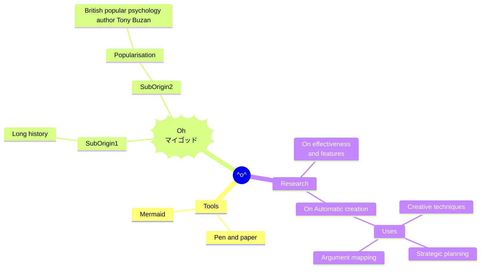
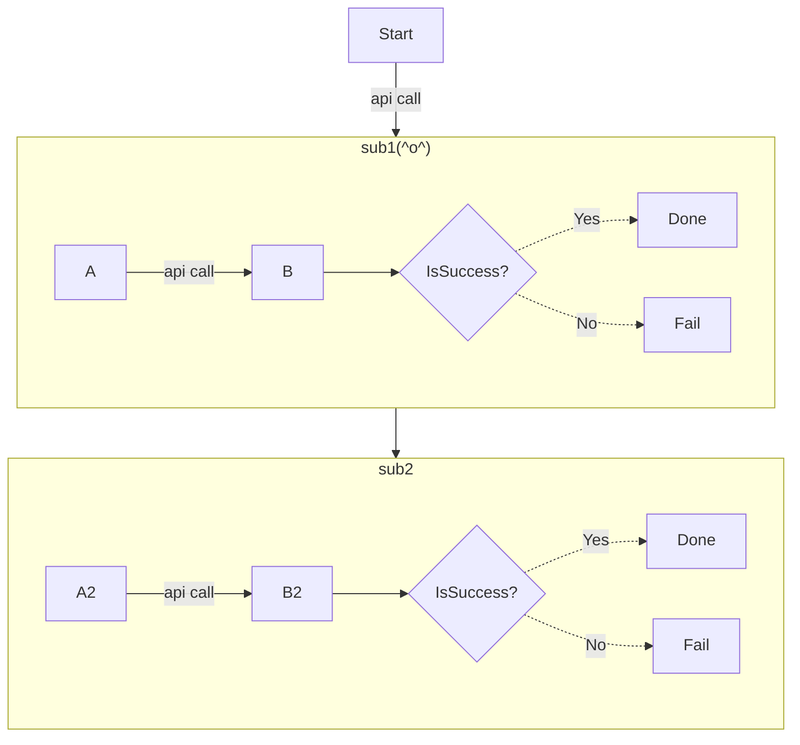

## mindmap



## flowchart 



- orientation: LR,TB

- arrow style

```
    ---
    -.-
    -->
    --o
    --x
    <-->
    o--o
    x--x
```

- text label

    ```
    [ラベル]
    -->|矢印テキスト|
    {分岐}
    ```

- arrow length

   ```
    -->
    ---->
    ----->
    -.->
    -...->
    -....->
   ```

- subgraph
- click
- comment: `%% this is a comment A -- text --> B{node}`
- Expanded Node Shapes in Mermaid Flowcharts (v11.3.0+)
  - Mermaid introduces 30 new shapes to enhance the flexibility and precision of flowchart creation. 


