# Mermaidスニペット
## Reference

- Flowchart Diagram https://mermaid.js.org/syntax/flowchart.html
- Sequence Diagram https://mermaid.js.org/syntax/sequenceDiagram.html
- Class Diagram https://mermaid.js.org/syntax/classDiagram.html
- State Diagram https://mermaid.js.org/syntax/stateDiagram.html
- Entity Relationship Diagram https://mermaid.js.org/syntax/entityRelationshipDiagram.html
- User Journey https://mermaid.js.org/syntax/userJourney.html
- Gantt https://mermaid.js.org/syntax/gantt.html
- Pie Chart https://mermaid.js.org/syntax/pie.html
- Quadrant Chart https://mermaid.js.org/syntax/quadrantChart.html
- Requirement Diagram https://mermaid.js.org/syntax/requirementDiagram.html
- Gitgraph (Git) Diagram https://mermaid.js.org/syntax/gitgraph.html
- C4 Diagram 🦺⚠️ https://mermaid.js.org/syntax/c4.html
- Mindmaps https://mermaid.js.org/syntax/mindmap.html
- Timeline https://mermaid.js.org/syntax/timeline.html
- ZenUML https://mermaid.js.org/syntax/zenUML.html
- Sankey 🔥 https://mermaid.js.org/syntax/sankey.html
- XY Chart 🔥 https://mermaid.js.org/syntax/xyChart.html
- Block Diagram 🔥 https://mermaid.js.org/syntax/blockDiagram.html
- Packet 🔥 https://mermaid.js.org/syntax/packet.html
- Kanban 🔥 https://mermaid.js.org/syntax/kanban.html
- Architecture 🔥 https://mermaid.js.org/syntax/architecture.html

## Sample

### 0. Flowchart

- flowchartの例

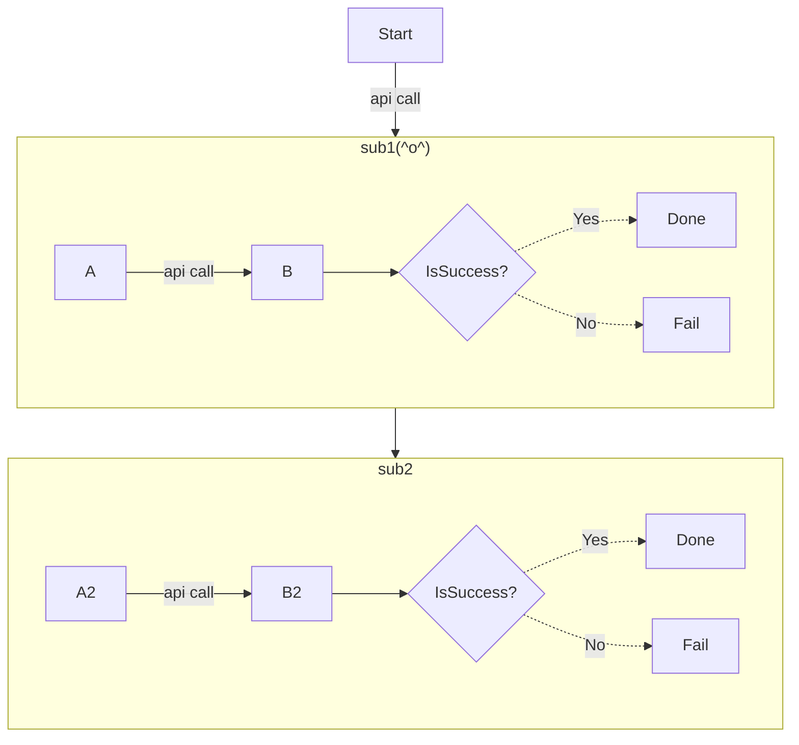

- Expanded Node Shapes in Mermaid Flowcharts (v11.3.0+)
  - Mermaid introduces 30 new shapes to enhance the flexibility and precision of flowchart creation. 

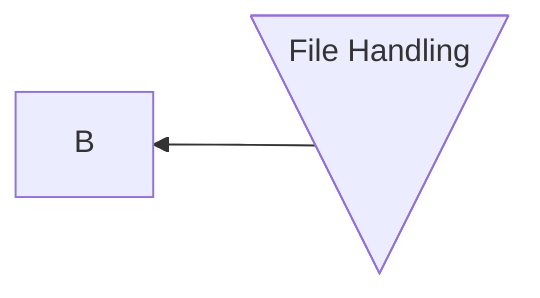

- flowchartの構成要素
  - flowchart: mermaid flowchartのエントリーポイント
  - orientation: フローチャートの向き。LRは左から右に向かうチャート,TBは上から下に向かうチャート。
  - span(arrow) style: 動線のスタイル。実線と点線。右端・両端の矢印・記号(<, >・x・⚫︎)の有無が調整可能。、---は動線のみ・記号なし, -.-は動線のみ・記号なしで点線, -->は右向きの矢印・実線, --oは右側に⚫︎がついた実線, --xは右側にxがついた実線, <-->は両端に矢印がついた動線, o--oは両端に⚫︎がついた動線, x--xは両端にxがついた動線
  - span length: 矢印の長さは、ハイフン(-)の数で調整可能。数が多い方が長い。-->, ---->, ----->, -.->, -...->, -....->
  - text label: ノードや動線にラベルを付与できる。例えばY2[Done]は、Y2というノードのラベルをDoneと設定する。--> |api call|は、動線（右矢印付きの実線）に「api call」というラベルを設定する
  - conditional process(): ノード作成時に{}という括弧記号を使うことで、条件分岐のノードを作成できる。条件分岐ノードの具体例はCheckResultB2{IsSuccess?}。CheckResultB2という分岐のノード（菱形の図形）をフローチャート上に作成される（表示されるラベルはIsSuccess?）
  - subgraph: 「subgraph」という構文で、フローチャート内に複数の部分チャートを表現することができる subgraph 名前 で始まり endで終わる。
  - click: ノードに外部リンクを設定できる。例えば、click B href "https://www.github.com" "Yes"は、Bというノードに外部リンクを設定する。
  - comment: フローチャート内にコメントを記載できる。「%%」から始まる行がコメントです。コメントはmermaidでレンダリング後は表示されませんが、mermaidのコードの可読性やメンテナンス性を高める効果がある。コメントの具体例は、%% this is a comment A -- text --> B{node}です

### 1. Sequence Diagram

- **Example:**

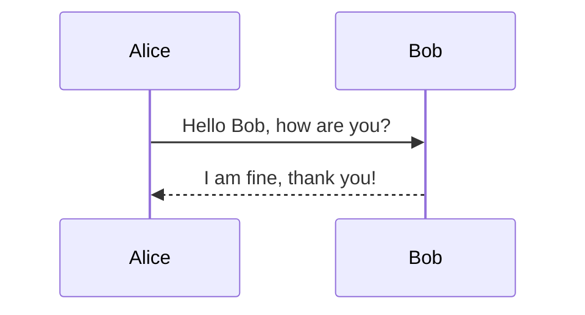
- **Components:**
  - `participant`: Define entities (e.g., Alice, Bob).
  - `->>`: Denotes messages.
  - `-->>`: Denotes responses.

### 2. Class Diagram
- **Example:**
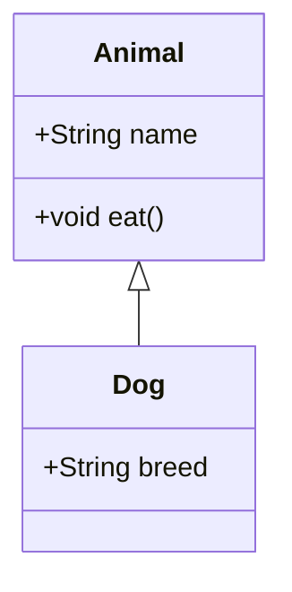
- **Components:**
  - `class`: Defines a class.
  - Attributes and methods: Listed inside the class.
  - Relationships: `<|--` denotes inheritance.

### 3. State Diagram
- **Example:**
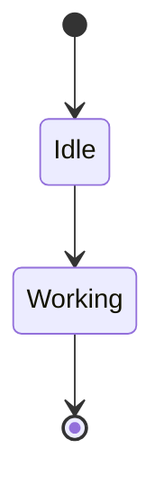
- **Components:**
  - States: e.g., `Idle`, `Working`.
  - Transitions: `-->` denotes state transitions.

### 4. Entity Relationship Diagram
- **Example:**
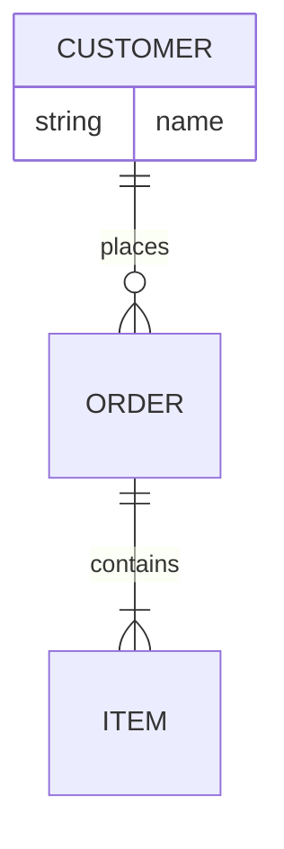
- **Components:**
  - Entities: `CUSTOMER`, `ORDER`, `ITEM`.
  - Relationships: `||--o{` (one-to-many).

### 5. User Journey
- **Example:**
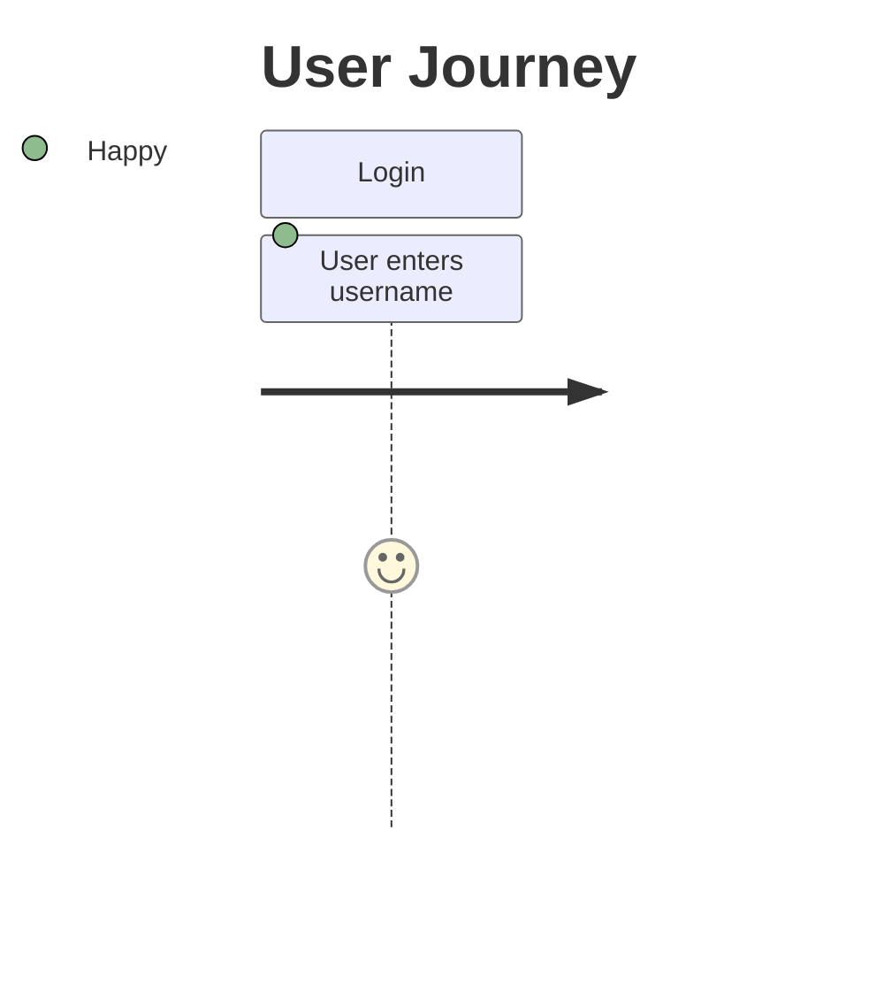
- **Components:**
  - `title`: Title of the journey.
  - `section`: A phase or action.

### 6. Gantt
- **Example:**
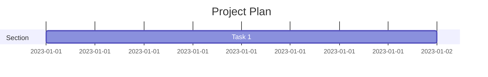
- **Components:**
  - `section`: Logical grouping.
  - Tasks: Defined with duration.

### 7. Pie Chart
- **Example:**
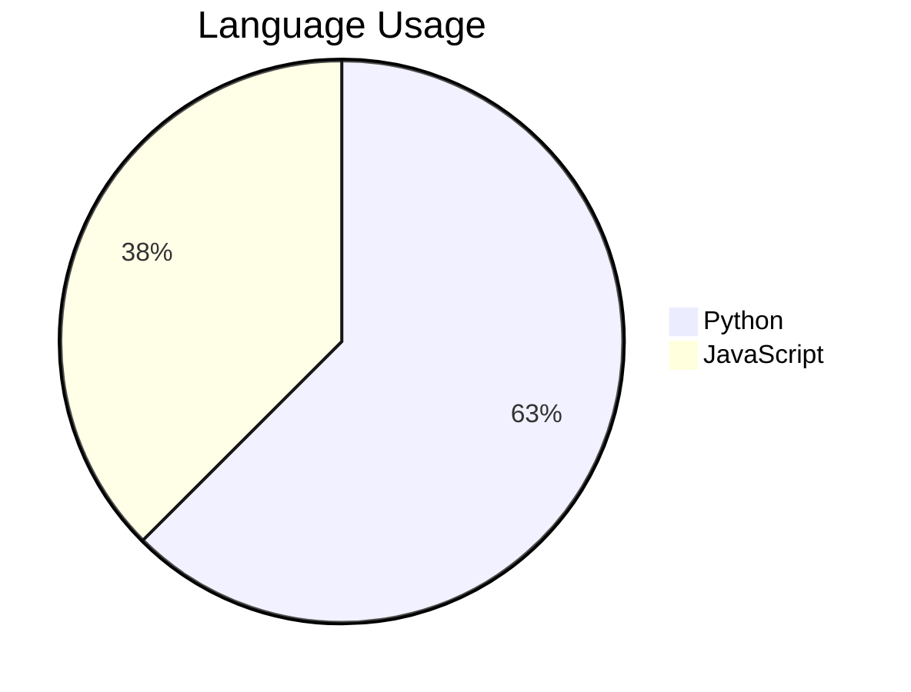
- **Components:**
  - Sectors: Defined with labels and values.

### 8. Quadrant Chart
- **Example:**
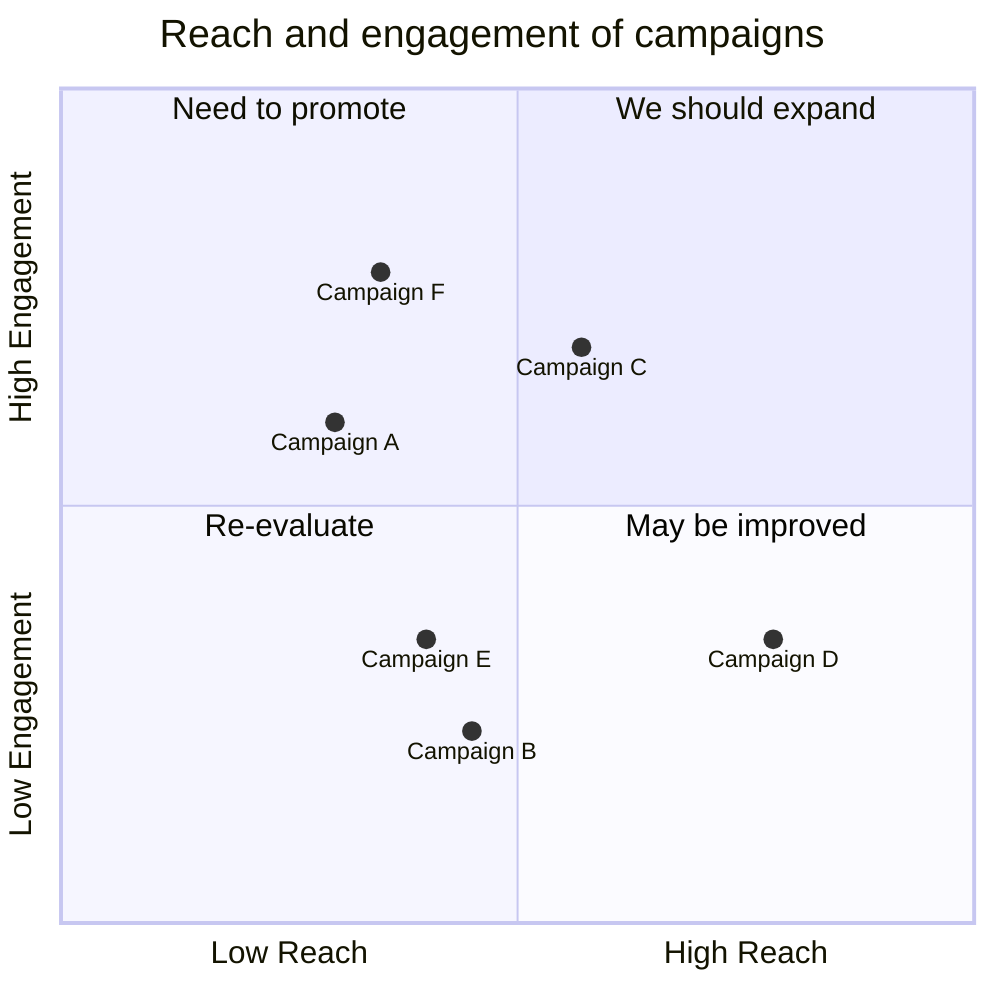
- **Components:**
  - Axes: `x1`, `y1`.
  - Labels: Titles for sections.

### 9. Requirement Diagram
- **Example:**
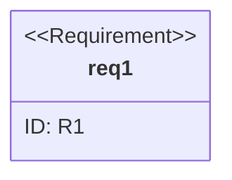
- **Components:**
  - Requirements: `requirement req1`.
  - Attributes: e.g., `id`.

### 10. Gitgraph (Git) Diagram
- **Example:**
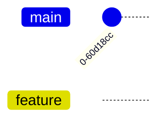
- **Components:**
  - `commit`: Represents a commit.
  - `branch`: Defines a branch.

### 11. C4 Diagram
- **Example:**

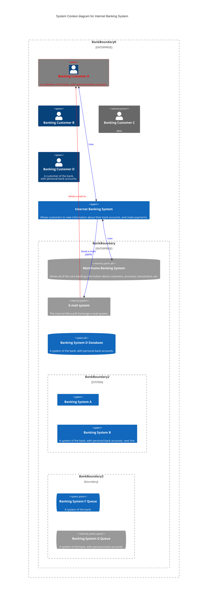

- **Components:**
  - Entities: `Person(User)`.

### 12. Mindmaps
- **Example:**


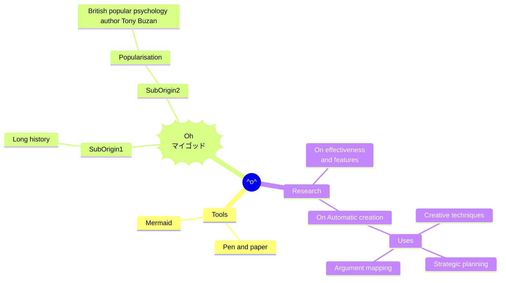

- **Components:**
  - Root and Nodes: `root`, `child1`.

### 13. Timeline
- **Example:**
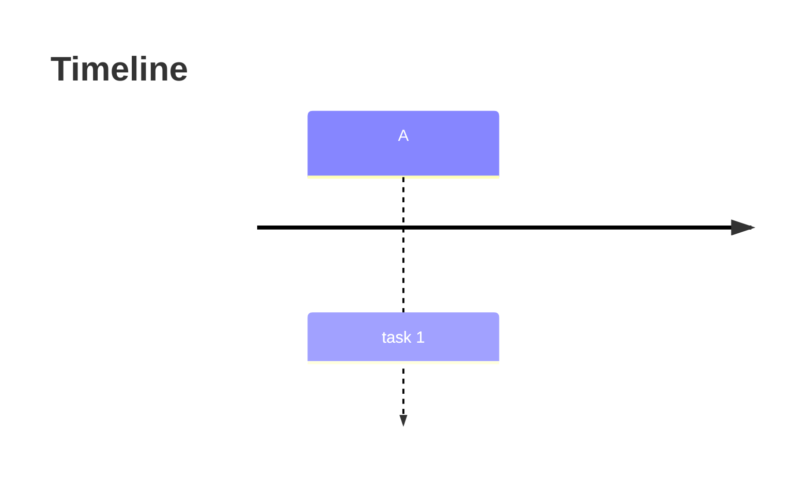
- **Components:**
  - Events: `A: task 1`.

### 14. ZenUML
- **Example:**
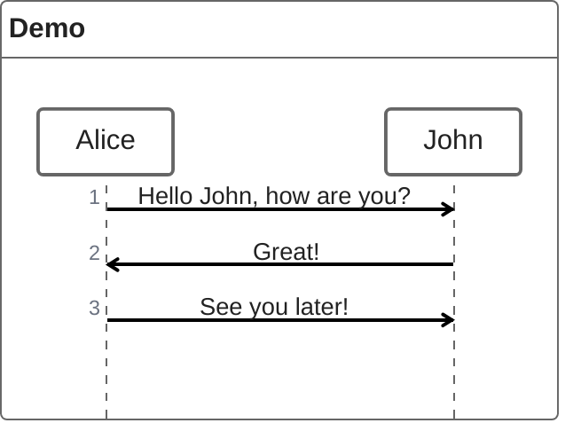

- **Components:**
  - Actions: `Alice -> Bob`.

### 15. Sankey
- **Example:**
```mermaid
sankey
    A[Source] --> B[Target]
```
- **Components:**
  - Flows: `A --> B`.

### 16. XY Chart
- **Example:**
```mermaid
xyChart
    x: 1, y: 2
```
- **Components:**
  - Points: `x`, `y` values.

### 17. Block Diagram
- **Example:**
```mermaid
blockDiagram
    block main {
    }
```
- **Components:**
  - Blocks: Defined regions.

### 18. Packet
- **Example:**

- **Components:**
  - Packets: Logical groupings.

### 19. Kanban
- **Example:**
```mermaid
kanban
    section To Do
```
- **Components:**
  - Sections: `To Do`, `In Progress`.

### 20. Architecture
- **Example:**
```mermaid
architecture
    system A
```
- **Components:**
  - Systems: Logical units.

